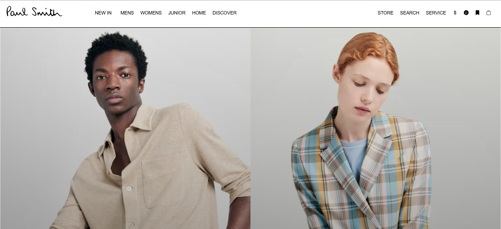
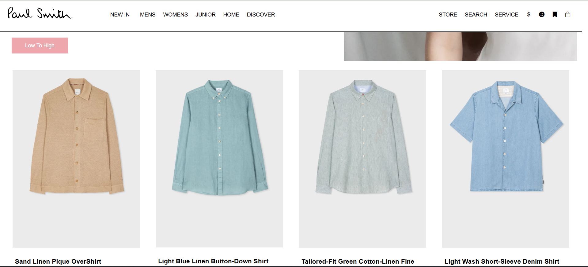
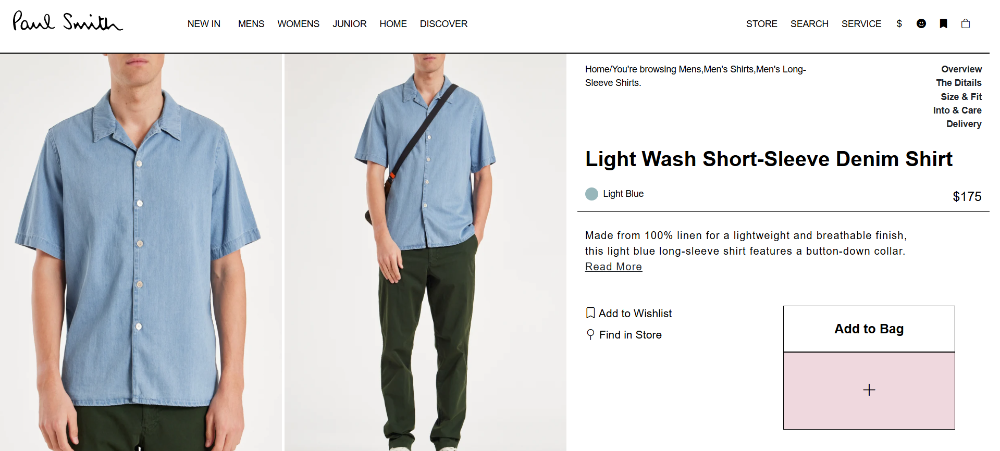
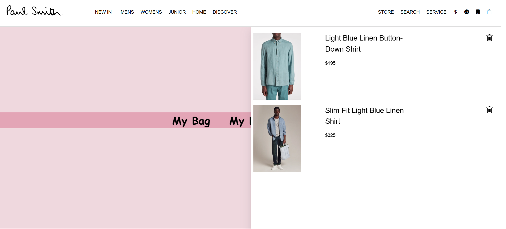

# Paul Smith

## Overview
This is a web application built using HTML, CSS, Bootstrap, jQuery, and JavaScript.

## Hosting Link
The application is hosted at:
[Live Website](https://paul-smith.vercel.app/)

## Features
- **Product Management**: Display of products with descriptions and cart functionality.
- **Responsive Design**: Built with Bootstrap for a mobile-friendly experience.

## Technologies Used
- HTML
- CSS
- Bootstrap
- jQuery
- JavaScript

## Screenshots
Below are some screenshots of different pages in the application:

### Home Page


### Product Page


### Description Page


### Cart Page


## Installation
To run the project locally, follow these steps:

1. Clone the repository:
   ```sh
   git clone git@github.com:divyesh004/Paul-smith.git
   ```
2. Navigate to the project directory:
   ```sh
   cd project-folder
   ```
3. Install dependencies:
   ```sh
   npm install
   ```
4. Start the development server:
   ```sh
   npm start
   ```

## License
This project is licensed under the MIT License.
